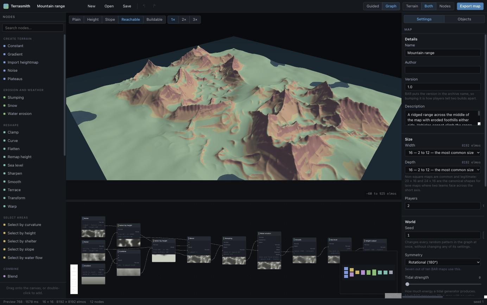
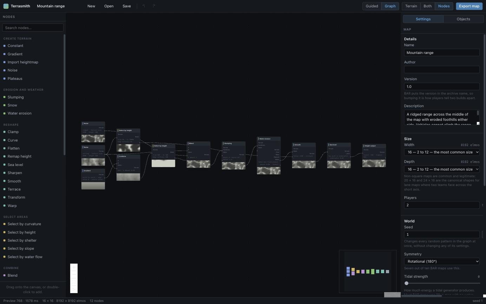

# Terrasmith

Terrasmith is a node-based terrain builder that targets [Beyond All Reason](https://www.beyondallreason.info/)
directly: you shape a landscape, and it writes a `.sd7` the engine loads, with the heightmap, textures,
metal map, `mapinfo.lua` and lobby metadata already correct. It is for people who want to make a BAR map
and would rather spend that time on the map than on the toolchain.

The difference from a general terrain tool is that Terrasmith knows what the terrain is *for*. It can tell
you that the ramp you just cut is 31 degrees, so vehicles cannot use it but bots can; that the pad in your
main base is 80 elmos across and a bot lab needs 96; that the metal blob you painted is 190 elmos wide and
no single extractor can capture it.

**[Open the editor](https://yufanwang07.github.io/terrasmith/)** — it runs entirely in the browser, builds
the archive client-side, and needs no account.



*Above: the viewport with "who can go here" on — green is passable by the selected unit class, red is not.
Below: the same map's node graph.*



## Why this exists

Making a BAR map today means driving five unrelated programs and knowing a pile of conventions none of them
document. The workflow, reconstructed from BAR's own guides and from the `pymapconv` source, is in
[docs/research/toolchain.md](docs/research/toolchain.md) §7. The short version of what hurts:

- **The resolutions do not line up.** World Machine's canvas is a power of two; the `.smf` heightmap is
  `64N+1` samples. The community workaround is to export at eight times the resolution and let
  `pymapconv --highresheightmapfilter nearest` sample texel centres, because otherwise resizing 2048 to
  1281 in Photoshop smears every cliff edge relative to the texture that is supposed to sit on it.
- **You type the height range in by hand.** `pymapconv -n`/`-x` take the minimum and maximum height as
  numbers you guess. Guess wrong and the whole map is squashed or clipped, and you recompile.
- **Seven more images, at six resolutions, with three channel conventions.** Normals at `512N`, specular at
  `256N`, splat at a power of two, metalmap and typemap at `32N` as 8-bit *RGB* BMPs (greyscale silently
  produces a broken map), grass at `16N`, features at `64N`. Every DDS has to be vertically flipped, which
  on Windows means a drag-and-drop `.bat` and on Linux means running the ImageMagick scripts by hand. None
  of them regenerate when you change the heightmap.
- **The texture has to agree with the slope map, and nothing checks that it does.** BAR's map checklist
  asks for vehicle-flat ground, bot-only ground and all-terrain ground to be visually distinct. That is a
  correspondence between two files maintained by hand.
- **Nothing tells you whether the map is playable until you play it.** The current method for finding
  unreachable pockets and unclimbable ramps is to load the map in SpringBoard and drive `armpw`, `armstump`,
  `armch` and `armbats` around looking for trouble. Manual, slow, and not reproducible.
- **Then you hand-write ~200 lines of `mapinfo.lua`** — lighting, fog, water, `tidalStrength`, splat
  scales, team start positions — usually by copying another map's and tuning by trial and error, restarting
  the engine each time.
- **And the failures do not stop you.** Rename the `.smt` after compiling without fixing the name recorded
  inside the `.smf` and the engine does not error out: it logs one line and fills every tile with `0xaa`,
  which is the famous pink map. Pack the archive solid and it still loads — just decompressed on one
  thread — because the engine's own rejection path is dormant on current Recoil master; you find out when
  BAR's CI refuses the archive and your pull request will not merge.

The number that matters: **the realistic loop time for a one-pixel terrain change is 10 to 40 minutes.**
That is the thing to beat, and it is why Terrasmith is one program that owns the whole chain rather than
another heightmap exporter.

## Getting started

Requires Node 22.12 or newer.

```bash
git clone https://github.com/yufanwang07/terrasmith
cd terrasmith
npm install
npm run build
```

Run the editor:

```bash
npm run dev          # vite dev server; open the URL it prints
```

Or build a project file from the command line. The CLI is `packages/cli/dist/cli.js`, and the workspace
exposes it as `terrasmith` once its bin is linked:

```bash
node packages/cli/dist/cli.js build my-map.terrasmith     # writes MyMap.sd7 beside the project
node packages/cli/dist/cli.js build my-map.terrasmith --quality final -o dist/MyMap_v2.sd7
node packages/cli/dist/cli.js inspect my-map.terrasmith   # size, seed, symmetry, node counts
node packages/cli/dist/cli.js nodes                       # the node catalog, by category
```

To play the result, copy the `.sd7` into the `maps/` folder of your BAR data directory — the same folder
the client downloads maps into — and start BAR. The map appears in the map list under the name in its
`mapinfo.lua`, not under its filename. If you would rather skip the archive while iterating, an unpacked
`MyMap.sdd/` directory with the same contents works just as well.

To see what the shipped templates look like without opening the editor:

```bash
node tools/render-templates.mjs
```

It writes hillshaded and flat-albedo PNGs to `samples/renders/` and prints, per template, the height range
and the percentage of the map that is drivable, impassable and underwater.

## Documentation

- **[Making your first BAR map](docs/GUIDE.md)** — the guide to read if you play BAR and have never used a
  terrain tool. Map sizes for a given player count, where flat ground has to go, how metal spots work, why
  180-degree rotation is the symmetry to reach for, and how to get a finished map into BAR's pool.
- **[Node reference](docs/NODES.md)** — every node, its ports and its parameters.
- **[Architecture](docs/ARCHITECTURE.md)** — how the packages fit together and why.
- **[Research](docs/research/)** — the engine-verified reference material the whole project is written
  against: the SMF and SMT binary formats, `mapinfo.lua`, BAR's gameplay constraints, the archive and
  publishing pipeline, the existing toolchain, and terrain algorithms. Each document cites engine and game
  source by file and line, and carries a verification log.

## Packages

| Package | What it is for |
| --- | --- |
| `@terrasmith/format` | Reading and writing the Spring/Recoil binary formats: `.smf`, `.smt`, DXT1/DDS, `mapinfo.lua`, and `.sd7`/`.sdz` archives. Written against the engine source, not against folklore. |
| `@terrasmith/core` | The terrain maths. Fields, noise, erosion, slope/curvature/flow/occlusion analysis, symmetry, texturing — plus the BAR rules module: move classes, pathing, metal spot detection, and map validation. |
| `@terrasmith/graph` | The node graph: the type system, the evaluator, the project document, the node catalog and the starter templates. |
| `@terrasmith/build` | Project in, map archive out. Evaluates the graph, quantises the heightfield, bakes and dedupes tiles, derives the type/metal/grass maps, and assembles the archive. |
| `@terrasmith/cli` | `terrasmith build`, `inspect` and `nodes`, for batch builds and CI. |
| `apps/studio` | The editor: React, a terrain viewport, the node graph, overlays and a guided mode. |

Nothing below `apps/studio` touches the DOM, and `format`, `core` and `graph` use no Node built-ins, so
every layer runs in a browser tab, in a worker, in Node and in CI.

## What works today

- **The format layer.** `.smf` and `.smt` writers and readers, a BC1 encoder that stays in the opaque
  four-colour mode the engine requires, DDS, the 699048-byte minimap block, `mapinfo.lua` generation, and
  both archive containers. Covered by tests in `packages/format/test/`.
- **The terrain engine.** Resolution-independent noise, droplet and pipe hydraulic erosion, thermal
  slumping, and the analysis fields the selectors and overlays are built on.
- **The BAR rules.** BAR's move classes with their real slope and depth limits, the buildability rule
  (which is a height-difference test, not a slope test), a faithful port of BAR's metal spot finder, and a
  validator that checks size, height range, slope bands, reachability, start positions, build pads, metal,
  water and symmetry.
- **The node graph.** 50 node types across generators, layout, filters, combiners, selectors, natural processes, gameplay,
  outputs and utilities, with a pull-based evaluator memoised on content hashes. The CLI's `nodes` command
  prints the live list; [docs/NODES.md](docs/NODES.md) is the written reference.
- **Seven templates** that are complete, buildable maps rather than empty graphs.
- **The build pipeline and CLI.** A project file becomes a loadable `.sd7` containing the `.smf`, the
  deduplicated `.smt`, a generated `mapinfo.lua`, the `maphelper` shim, a `maps-metadata` record and a
  metal layout Lua file.

## What does not work yet

Being concrete about this is more useful than a roadmap.

- **The editor is young.** The viewport, toolbar, overlays, evaluation workers, node graph, palette,
  inspector, guided-mode panel and the template/export/issues dialogs are all wired up in
  `apps/studio/src/App.tsx`, but the editor has had far less exercise than the CLI, which is the path
  covered end to end by tests.
- **Everything runs on the CPU.** The WebGPU acceleration the architecture describes does not exist. A
  full-resolution erosion pass on a 24x24 map is minutes, not seconds.
- **Features are placed by hand, not generated.** Metal spots, start positions and geothermal vents are
  placed in the viewport and read by the exporter, and `gameplay.metalSpots` will lay out a symmetric
  metal map for you. Trees and rocks are in the project model and in the archive writer, but nothing
  generates or edits them, so a map ships bare.
- **The terrain reads as terrain, not yet as a place.** The palettes and the templates have had a pass
  and `samples/renders/` is worth judging for yourself, but the ridged generator puts a quarter of a map
  in the bottom tenth of its range at the default sharpness — flat-floored valleys with ridges out of
  them, which suits some maps and makes others look like a plain with spikes. The dial is there; the
  defaults are one person's taste.
- **The advanced-shading texture set is packed but barely tuned.** The build writes a specular map and
  four tiling detail-normal textures into `maps/` and names them in the generated `mapinfo.lua`'s
  `resources` block, so the engine takes its advanced shading path. But the splat-distribution map is only
  written when a Splat output is connected, the map-sized detail normal map is off unless you ask for it,
  and the `texMults` strengths are a first guess rather than the result of looking at a map in game.
- **No `.sd7` importer.** `generator.importHeightmap` reads a 16-bit PNG or an r16 from World Machine,
  Gaea, L3DT or Blender, but you cannot open a finished map archive and edit it, even though the format
  layer can read one.

## Contributing

The repository is an npm workspaces monorepo.

```bash
npm test          # vitest
npm run typecheck # tsc --build across every package
npm run lint
```

Two things to know before writing code here:

1. **`docs/research/` is the reference, not your memory.** Those documents are written against the Recoil
   engine source, BAR's game data and real shipped map archives, with file and line citations and a
   verification log. If a constant in the code disagrees with one of them, one of the two is a bug.
2. **Comments explain why.** The constraint, the engine rule, the numerical trap, the reason a constant has
   that value. `packages/core/src/analysis.ts` and `packages/graph/src/nodes/filters.ts` are the house
   style.

If you are adding a node, its label, description and parameter help are read by people who have never
opened a terrain tool. Write them for that reader, and where a BAR number matters — 27 degrees stops
vehicles, water is at height 0 — say so.

## Licence

MIT. See [LICENSE](LICENSE).
